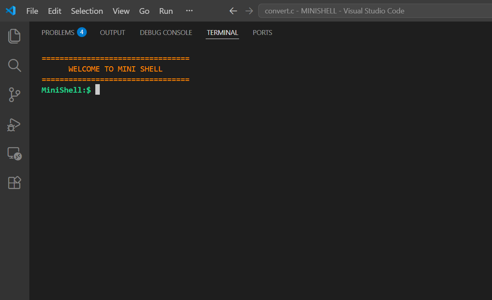
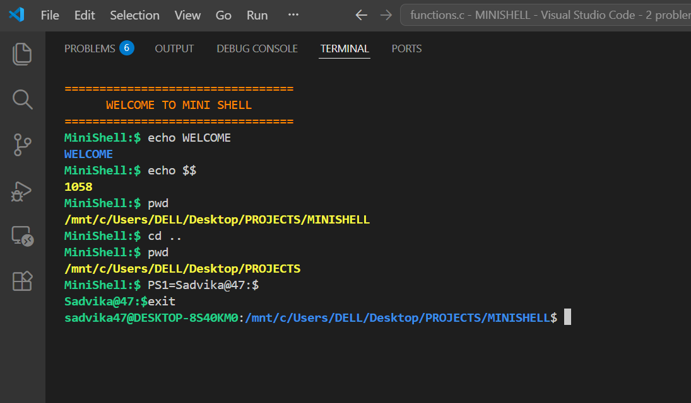
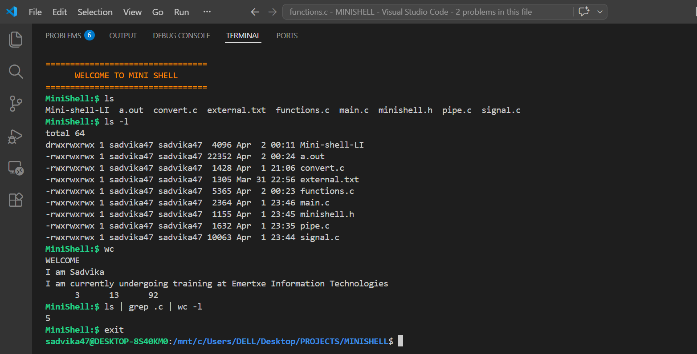
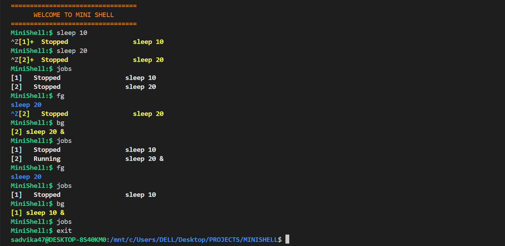
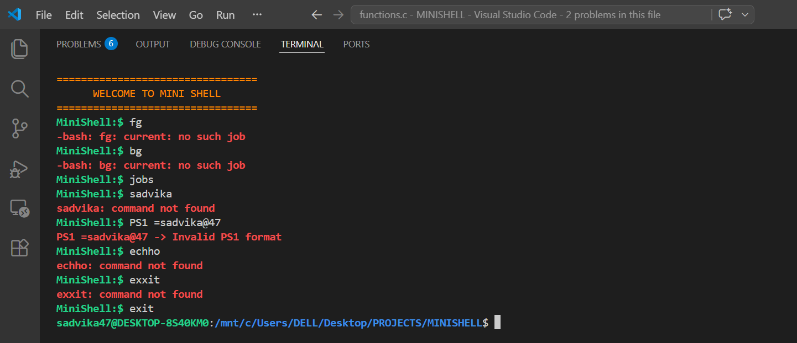

# 🐚 MiniShell

A custom Unix shell built in C that supports foreground/background job control, signal handling, piped commands, and built-in commands — mimicking core bash behavior.

---

## 📁 Project Structure

```
minishell/
├── minishell.h          # Header file — macros, color codes, function prototypes
├── main.c               # Entry point — signal registration, shell init
├── functions.c         # Input loop — command parsing, fork/exec, built-ins
├── signal.c               # Job control — signal handler, fg, bg, jobs, linked list
├── pipe.c               # Pipe execution — multi-command pipe chaining
├── convert.c           # Loads external commands from external.txt
└── external.txt         # List of supported external commands (one per line)
```

---

## ⚙️ Features

### ✅ Built-in Commands
| Command | Description |
|---|---|
| `pwd` | Print current working directory |
| `cd <path>` | Change directory |
| `echo <text>` | Print text to stdout |
| `echo $$` | Print shell's PID |
| `echo $?` | Print exit status of last command |
| `echo $SHELL` | Print current working directory (shell path) |
| `exit` | Exit the shell |
| `clear` | Clear the terminal screen |
| `PS1=<prompt>` | Change the shell prompt |

### ✅ External Commands
- Loaded from `external.txt` at startup into a 2D array
- Executed via `fork()` + `execvp()`

### ✅ Piped Commands
- Supports multi-command pipes: `ls | grep txt | wc -l`
- Each command runs in its own child process with `stdin`/`stdout` redirected

### ✅ Job Control
| Command | Description |
|---|---|
| `jobs` | List all stopped/running background jobs |
| `fg` | Bring last job to foreground |
| `bg` | Resume last stopped job in background |
| `Ctrl+C` | Kill foreground process (SIGINT) |
| `Ctrl+Z` | Stop foreground process and add to jobs list (SIGTSTP) |

---

## 🔁 How It Works

### Shell Loop (`scan_input.c`)
1. Print prompt → read input via `scanf`
2. Check for `PS1=` to update prompt
3. If `jobs`, `fg`, `bg` → call `signal_handler_commands()`
4. Else → extract first word → check if BUILTIN / EXTERNAL / NO_COMMAND
5. For EXTERNAL: `fork()` → parent `waitpid()`, child resets signals and calls `execvp()`

### Signal Handling (`jobs.c`)

Three signals are registered in `main()`:
```c
signal(SIGINT,  signal_handler);   // Ctrl+C
signal(SIGTSTP, signal_handler);   // Ctrl+Z
signal(SIGCHLD, signal_handler);   // child finished
```

| Signal | Behavior |
|---|---|
| `SIGINT` | If no child running → reprint prompt. If child running → default handler kills it |
| `SIGTSTP` | Stops foreground child. If pid already in jobs list → update status to STOPPED. If new → `insert_last()` and assign job number |
| `SIGCHLD` | Fires when a background job finishes. Loops `waitpid(-1, WNOHANG)` to reap all finished children, prints Done, removes from list |

> **Why SIGCHLD only for bg?** — `fg` jobs are already waited on directly via `waitpid(WUNTRACED)` in the fg handler, so the shell knows when they finish. Background jobs have no direct wait, so SIGCHLD is the only way to know they're done.

### Job Control List
- Jobs are stored as a **singly linked list** of `Slist` nodes
- Each node stores: `job_num`, `pid`, `status` (RUNNING/STOPPED), `input` (command string)
- `insert_last()` — adds new STOPPED job at end, assigns incremented `job_counter`
- `delete_last()` — removes last job, resets `job_counter` to 0 when list is empty

### `fg` Command Flow
```
fg called
  → find last job in list → send SIGCONT → waitpid(WUNTRACED)
      ├── process exits normally   → WIFSTOPPED = false → delete from list
      └── Ctrl+Z pressed again     → WIFSTOPPED = true  → keep in list (SIGTSTP handler already updated it)
```

### Pipe Execution (`pipe.c`)
1. Scan args for `|` to find command boundaries and count them
2. Save original `stdin` with `dup(0)`
3. For each command: `pipe()` → `fork()` → child redirects `stdout` to pipe write end → `execvp()`
4. Parent redirects `stdin` to pipe read end for next iteration
5. After all children forked → restore `stdin` → `wait()` for all

---

## 🎨 Output Color Scheme

| Color | Used For |
|---|---|
| 🟢 Green | Prompt, normal shell output |
| 🔵 Blue | fg command output, echo text |
| 🟡 Yellow | Stopped/Running job messages, pwd/echo results |
| 🔴 Red | Errors (command not found, invalid PS1, no such job) |
| ⚪ White | jobs list output |
| 🟠 Orange | Welcome banner |

---

## 🖼️ Output Screenshots
### Welcome Banner


### Built-in Commands


### Pipe Execution


### Job Control


### Error Handling


---

## 🛠️ How to Compile & Run

```bash
gcc main.c scan_input.c jobs.c pipe.c external.c -o minishell
./minishell
```

> Make sure `external.txt` is in the same directory as the binary.

---

## 📌 Notes

- `input_string` is a global `char[50]` — commands longer than 49 chars may cause issues
- `delete_last()` always removes the **last** node — works correctly as jobs are processed in LIFO order for `fg`/`bg`
- `job_counter` resets to 0 only when the list becomes completely empty
- Child processes reset `SIGINT` and `SIGTSTP` to `SIG_DFL` so they behave like normal Unix processes
